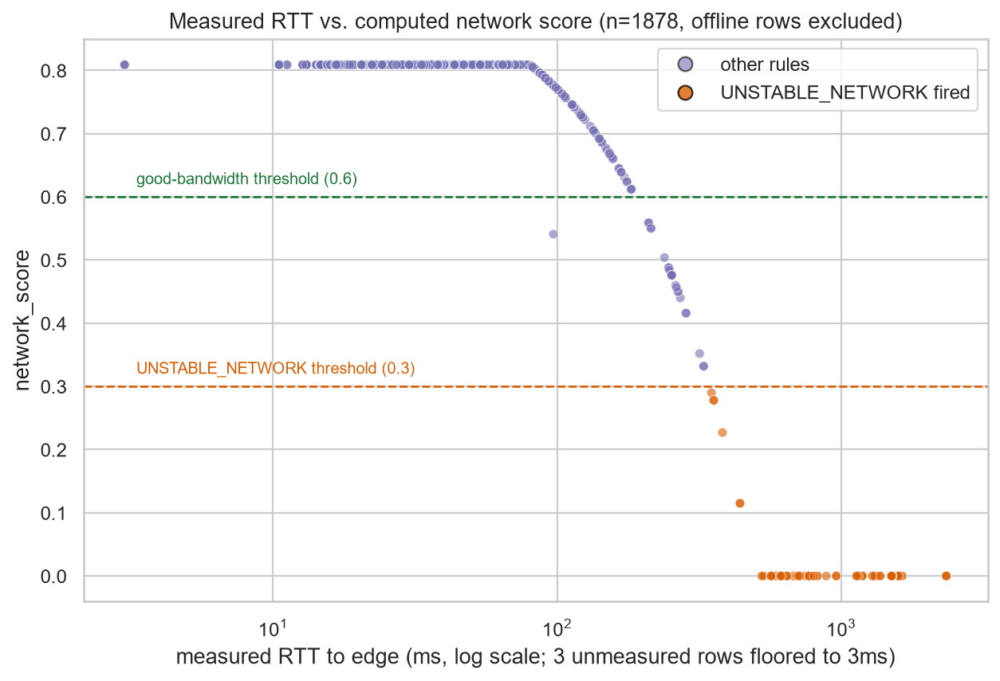
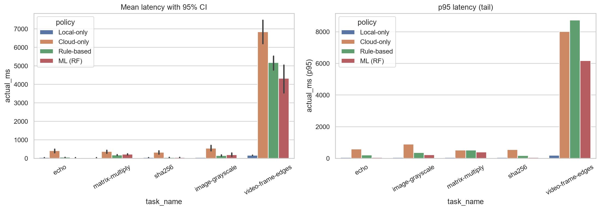
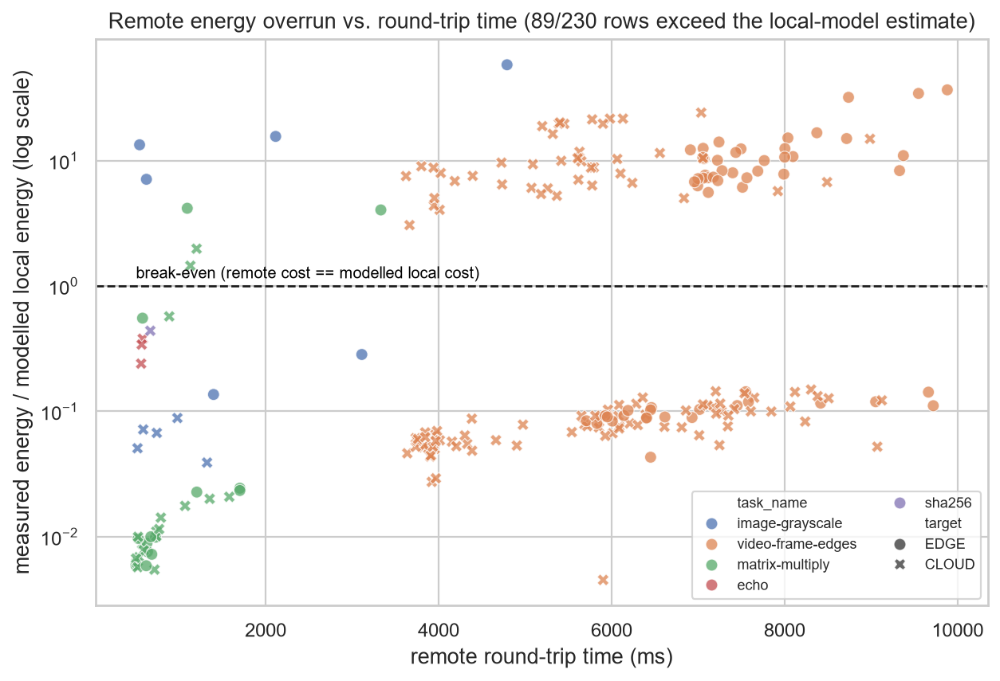
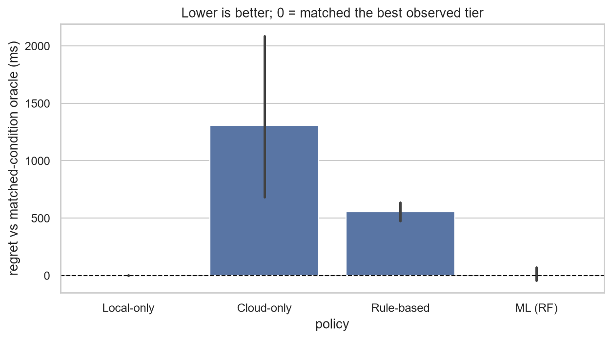
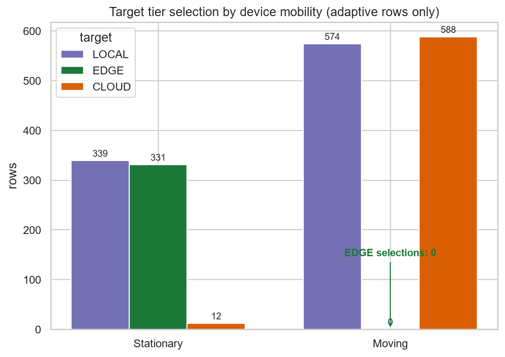

# Evaluation

This chapter reports the empirical evaluation of CloudAware-MOCCA against a
physical Android device, a containerised edge node, and a containerised cloud
node. All figures and numbers are computed directly from
`evaluation/data/training.csv` (2184 rows collected end-to-end on real hardware
over a real Wi-Fi network: 1928 rows from the rule-based and forced-baseline
sessions — which now include a large targeted-mobility augmentation described in
Section 5.4 — plus a dedicated 256-row `ADAPTIVE_ML` session in which the
on-device Random Forest was the live planner) by
`evaluation/notebooks/random-forest-training.ipynb` and
`evaluation/make_evaluation_figures.py`; every value below can be recomputed
from that one file. The rule-engine-specific analyses (Sections 5.1, 5.3, 5.5)
are computed on the 1928 rule/baseline rows so that the machine-learning session
does not shift them; the policy-comparison analyses (latency in Section 5.2,
regret in Section 5.4) treat the Random Forest as a first-class policy alongside
the rule engine and the two fixed baselines.

**A note on dataset composition.** The dataset was expanded well beyond the
original healthy-usage collection with a targeted augmentation that forced the
mobility branch (STATIONARY/WALKING/VEHICLE via debug override) to enrich the
under-represented CLOUD class from 22 to 600 rows. This deliberately trades
*representativeness of natural usage* for *per-class classifier coverage*: the
CLOUD share below (32.5 %) is an artefact of that augmentation, not the policy's
natural routing rate (~4 % under stationary conditions — see Section 5.4). Where
a result depends on the dataset reflecting natural usage — most importantly the
energy validation and the learned-vs-rules distribution match — this is called
out explicitly rather than papered over.

## 5.1 Experimental Setup and Data Collection

**Testbed.** A Samsung Galaxy A56 (Android 14) over Wi-Fi, submitting tasks to
two Docker containers on a separate host: an edge tier capped at 2 vCPU/2 GB
and a cloud tier at 4 vCPU/4 GB, modelling the edge as resource-constrained
and the cloud as comparatively unconstrained. Both sit one network hop from
the phone, so a persistent 80 ms one-way `netem` delay was held on the cloud
container throughout collection to stand in for wide-area distance — declared
here as emulation, not measurement, since the constant was chosen rather than
observed from a live provider. Five task handlers spanning LIGHT/MEDIUM/HEAVY
complexity were used (`echo`, `sha256`, `image-grayscale`, `matrix-multiply`,
`video-frame-edges`), with payload size swept for three of them.

**Sessions.** Eleven collection sessions exercised the policy under distinct,
independently-verified conditions: a healthy baseline; a battery discharge
sweep; a four-step `netem` degradation sweep applied to *both* tiers
simultaneously (100 ms/0 % → 1000 ms/30 % loss) plus the WAN baseline held on
cloud; a Wi-Fi-disabled period; a CPU-flood period; forced LOCAL-only and
CLOUD-only baselines; a mobility sweep (movement state forced via debug
override); a payload-size sweep; and an edge-contention period (eight
synthetic clients). A subsequent **targeted-mobility augmentation** repeated the
healthy/mobility/battery/CPU/payload blocks several times to grow the dataset
to 1844 adaptive rows, chiefly to populate the CLOUD class and the regret
oracle's condition buckets (Section 5.4). Every adaptive rule cleared its
minimum required sample count. Every row in the dataset reflects a genuine
execution against the real servers described above — none is synthetic; the
augmentation rows differ only in that their movement state was forced, exactly
as the original mobility sweep already was, and they carry the same
`debug_overrides` flag so the notebook can exclude them from cost-model
validation.

Because the manipulation that matters most to this evaluation — injected
network degradation — happens on the Docker host, it is worth confirming it
actually reached the phone's own measurement rather than staying a
server-side artefact invisible to the policy:

*Figure 1 — Measured RTT to the edge tier vs. the resulting `network_score`
(offline rows excluded; log scale). The relationship is monotonically
decreasing as designed, and rows where `UNSTABLE_NETWORK` actually fired
(orange) cluster below the 0.30 threshold, in the RTT range the injected
`netem` steps targeted. This is direct evidence that the degradation reached
the decision policy on real hardware — the kind of manipulation-check a
simulated study has no equivalent of.*

## 5.2 System Performance: Reliability and Latency

The overall fallback rate — remote submissions that failed and forced local
re-execution — was **1.3 % (25/1928)**. The reliability cost is not spread
thinly, however: every one of the 25 fallbacks (17 `video-frame-edges`, 8
`matrix-multiply`, all large-payload heavy tasks) waited out the **full ~10.2 s
client timeout** (median 10{,}177 ms) before re-executing locally in a median of
35 ms. A fallback therefore costs the user a multi-second stall roughly 290× the
local execution it ultimately performs — so the rate understates the tail
experience, and the fallbacks concentrate on exactly the workload the policy
should arguably not have offloaded (Section 5.3). The edge forwarded work to the
cloud under its own overload detection in 18/946 remote rows (1.9 %), recorded
explicitly so it is never mistaken for edge performance. One baseline result is
reported without inflation: CLOUD-only (no fallback by design) recorded **zero
failures in 40 requests** — the network held up well enough in this session
that the resilience gap it exists to expose did not manifest, an observation
about this run's conditions rather than a general claim.

| Policy | n | Mean (ms) | Median (ms) | p95 (ms) |
|---|---:|---:|---:|---:|
| Rule-based (adaptive) | 1819 | 708.7 | **61.0** | 6087.2 |
| ML / Random Forest (adaptive) | 256 | 646.0 | **50.0** | 5547.0 |
| LOCAL-only baseline | 44 | 66.6 | 39.0 | 181.0 |
| CLOUD-only baseline | 40 | 1367.1 | 394.0 | 6852.9 |

*Figure 2 — Mean (with 95 % CI) and p95 latency per task, by policy. The
distributions are heavily right-skewed, so median is the load-bearing statistic.
The adaptive policy's value is best read against the two fixed baselines rather
than as an absolute speed-up: it delivers a ~6× median-latency improvement over
always-cloud (61 ms vs. 394 ms), while remaining within tens of milliseconds of
the always-local baseline (39 ms) on the light tasks that dominate the median.
The learned Random Forest policy tracks the rule engine closely (median 50 ms
vs. 61 ms).*

The direction of these gaps is confirmed by a percentile bootstrap (10{,}000
resamples) of the per-task mean-latency difference. The rule-based policy is
**significantly faster than always-cloud on all five tasks** (every 95 % CI
excludes zero; e.g. `video-frame-edges` −1668 ms, CI [−2435, −954]). It is,
however, **significantly *slower* than always-local on all five tasks** — most
starkly for `video-frame-edges` (+5006 ms, CI [+4644, +5364]), because local
execution of that task takes a median of only 170 ms whereas offloading its
~2.8 MB payload takes ~5.8 s. For this workload and network, then, local
execution is often the latency-optimal choice, and the adaptive policy's
contribution is primarily to *avoid the always-cloud penalty* rather than to
beat local execution; the case where offloading is a clear latency win did not
materialise for these five tasks at these payload sizes.

## 5.3 Cost Model Validation: Estimator and Energy Accuracy

Comparing each estimator's prediction against measured wall-clock time
(1354 trusted rows, excluding debug-overridden and offline-sentinel rows):
correlation was moderate across all three tiers (0.62–0.73), and CLOUD/EDGE
estimates undershoot actual latency by 360–870 ms — the cost model captures
relative ordering reasonably well without being quantitatively precise,
consistent with `LatencyEstimator`'s constants never having been calibrated
against a live network.

Energy validation is where the dataset expansion did the most damage, and this
is reported plainly rather than hidden. Two things changed:

1. **The local energy coefficient can no longer be validated on this dataset.**
   Reliable battery-current integration requires a task lasting ≥ 500 ms (below
   that the ~1 Hz sampling dominates). After the augmentation, *every* local
   execution completes in under 223 ms (median 35 ms across 680 local rows),
   because the heavy tasks that used to run locally were instead routed remotely
   by the forced-mobility conditions. No local row now clears the 500 ms
   threshold, so the previously-reported ~68× over-estimate of `CPU_POWER_MW =
   800 mW` is **unvalidated here** — a coverage regression the augmentation
   introduced. This should be re-collected with a LOCAL-only heavy-task session
   before the local coefficient is claimed either way.

2. **The remote coefficient is accurate only for some tasks.** Across 163 remote
   rows ≥ 500 ms the median measured/modelled energy ratio is 0.29 (the model
   *over*-estimates), but this is strongly task-dependent and the aggregate is
   dominated by `video-frame-edges` (the bulk of remote rows), for which the
   model over-estimates by roughly 4× (ratio ~0.23); the few light-task remote
   rows show the opposite, 2–4× under-estimation. The earlier "within 8 %"
   figure held only under the original, lighter task mix — it is a
   composition-dependent result, not a stable property of the coefficients.

Beyond calibration, the model has a duration-dependent blind spot it does not
account for at all: `est_remote_energy_mj` prices only the radio's own
transmit/idle draw, not the fact that the phone's screen and other subsystems
keep drawing whole-device power for the *entire* round trip.

*Figure 3 — Measured whole-device energy divided by what the model estimates
local execution would have cost, against round-trip time (rows below 500 ms
excluded as sampling noise). Across all 230 qualifying remote rows, **89
(39 %) measured more whole-device energy than the local alternative they were
chosen over**, and the effect is concentrated in `video-frame-edges`
round trips (3.6–9.9 s, ~2.8 MB payload), the largest of which reach ~35× above
break-even. Combined with the latency result in Section 5.2 — where offloading
that same task cost ~5.8 s against a 170 ms local execution — this identifies a
single root cause: `LatencyEstimator` and `EnergyEstimator` both under-price the
transmission of large payloads, so the policy offloads a task that is faster and
cheaper to run locally. That one mis-routing drives the latency tail (p95
6087 ms), the energy overruns here, and all 25 fallbacks (Section 5.2). A cost
model that scaled both the latency and the idle-energy terms by payload size and
round-trip time, rather than by the radio's active window alone, would remove it.*

**Energy consumed per policy.** Because energy is half of `BALANCED_COST`'s
objective, the whole-device energy actually spent under each policy is the
directly relevant measure. Table~1 reports the median measured energy per task.
The `ADAPTIVE_ML` session is excluded: its device-power telemetry reads a median
of 2874 mW against ~30 mW in every other session — an order-of-magnitude
session-specific artefact that makes its energy values non-comparable.

| Task | Local-only | Cloud-only | Rule-based |
|---|---:|---:|---:|
| `echo` | 1 | 9 | 2 |
| `sha256` | 1 | 8 | 1 |
| `image-grayscale` | 1 | 13 | 5 |
| `matrix-multiply` | 1 | 10 | 6 |
| `video-frame-edges` | 5 | 192 | 187 |

*Table 1 — Median measured whole-device energy (mJ) per task, by policy (clean
rows). Local execution is the cheapest option for every task, because the device
returns to idle quickly instead of staying awake for a network round trip. The
adaptive rule policy tracks local energy on the light tasks it keeps on-device
(1–6 mJ) but tracks cloud energy on the heavy tasks it offloads (187 mJ for
`video-frame-edges`). The honest conclusion is that the adaptive policy does
**not** save whole-device energy relative to always-local; it is more
energy-efficient than always-cloud (which pays the round-trip cost even for
trivial tasks), but energy is minimised by local execution. This is consistent
with the overrun in Figure 3 and reinforces that, for this workload, the energy
argument favours keeping large-payload tasks local.*

## 5.4 Decision Quality: Classifier and Regret Analysis

A 50-tree Random Forest trained on the 12 deployed features reached 0.989
test accuracy (0.999 ± 0.002 CV, majority-class floor 0.495). **This must not
be read as "the model is correct"**: its target label is the rule engine's
own output, so training it to imitate a deterministic function it observes
every feature of is expected to converge to near-perfect accuracy — this
number measures faithful imitation, not decision quality. That it is now 0.989
rather than the 1.000 reported on the smaller pre-augmentation set is, if
anything, healthier: with 461 test rows a handful of genuine boundary cases
(threshold jitter near the 1.5× compute floor) now surface, which is more
defensible than perfect reproduction. (An energy-augmented 15-feature variant
*reduced* both test and CV accuracy [0.989 → 0.987 test, 0.999 → 0.994 CV],
despite the three energy features claiming 14.5 % of Gini importance — evidence
they correlate with, rather than add signal beyond, features already in the
deployed set.)

Class balance was LOCAL 913 / EDGE 331 / CLOUD 600 in the 1844-row adaptive
training set. **CLOUD's 32.5 % share is not the policy's natural routing rate**
— it is a direct consequence of the targeted-mobility augmentation, which forced
the WALKING/VEHICLE states under which `pickRemoteTarget` reaches CLOUD. Under
naturally-observed *stationary* conditions the CLOUD share is ~4 %, so this
augmentation should be understood as a class-balancing measure for the
classifier, not as evidence that CLOUD is a common runtime outcome. The
augmentation's value is precisely that CLOUD per-class precision/recall
(both ≈ 0.99 on 150 test rows) can now be cited at all, where previously CLOUD
had ~6 test rows.

The deployed model's 12 features, ordered by how heavily the trained forest
relies on them, are:

| Feature | Description |
|---|---|
| `is_stable` | Boolean, true when the device is stationary (smoothed accelerometer linear acceleration `< 0.3 m/s²`; `MobilityCollector`). Gates EDGE eligibility — `pickRemoteTarget` allows EDGE only while stationary and routes to CLOUD while moving. |
| `speedup` | Ratio `est_local_ms / est_remote_ms` — the compute speedup from offloading, which the 1.5× compute floor gates on. |
| `est_remote_ms` | Estimated remote (edge/cloud) execution latency, transmission included (ms). |
| `est_local_ms` | Estimated on-device execution latency (ms). |
| `task_complexity` | Ordinal task weight: LIGHT = 0, MEDIUM = 1, HEAVY = 2. |
| `network_score` | Composite network-health score in [0, 1] derived from RTT, bandwidth, and loss. |
| `rtt_ms` | Measured round-trip time to the edge tier (ms). |
| `battery_percent` | Device battery level (0–100 %). |
| `cpu_percent` | Current device CPU utilisation (%). |
| `bandwidth_mbps` | Static per-transport downstream bandwidth capability estimate (`linkDownstreamBandwidthKbps`), not a live measurement. |
| `is_charging` | Boolean, true when the device is plugged in. |
| `network_type_rank` | Ordinal connection type: NONE = 0, LTE = 1, WIFI = 2, 5G = 3. |

*Table 2 — The 12 deployed RF features, ordered by their contribution to the
trained forest. The model leans overwhelmingly on `is_stable` and `speedup`,
with the two latency estimates next and the remaining features contributing
little. That `is_stable` leads must be read with the augmentation in mind: the
targeted-mobility collection forced STATIONARY/WALKING/VEHICLE so heavily that
it became a near-deterministic EDGE-vs-CLOUD split, weighting it far above what
natural (predominantly stationary) usage would produce — on the original dataset
it ranked below `speedup` and the latency estimates.*

Offline classification accuracy, however, says nothing about how the model
behaves once it is actually the planner. To close that gap, a dedicated
`ADAPTIVE_ML` session ran the Random Forest as the *live* on-device decision
maker for 256 real task executions (0 fallbacks, 0 errors), with tier
distribution LOCAL 55.1 % / EDGE 40.2 % / CLOUD 4.7 % and median latency 50 ms.
**A direct comparison of this distribution against the full rule pool is now
confounded** and is reported honestly rather than as a match: because the
augmentation skewed the rule pool toward CLOUD (overall LOCAL 50.2 % / EDGE
16.3 % / CLOUD 33.5 %), the two distributions no longer align at the aggregate
level. Restricted to the matched *stationary* conditions the `ADAPTIVE_ML`
session actually covered, the rule engine routes LOCAL 51.2 % / EDGE 44.7 % /
CLOUD 4.1 % — the CLOUD share realigns (4.1 % vs. 4.7 %), while the EDGE/LOCAL
split differs modestly. The defensible runtime-fidelity claim is therefore the
narrower one: on matched conditions the learned policy reproduces the rule
engine's CLOUD-gating behaviour and its median latency (50 ms vs. 61 ms) at
< 1 ms inference cost — not that it reproduces the full-pool distribution, which
the augmentation makes an apples-to-oranges comparison.

Because rule-generated labels cannot validate the rules that generated them,
the metric that actually speaks to decision quality is regret against a
matched-condition oracle: for each `(task, network, battery, cpu)` bucket
with ≥ 2 tiers observed and ≥ 3 samples each (12 of 36 populated buckets
qualified once the augmentation rows were included, up from 7 of 31), the best
empirically observed tier is ground truth.

| Policy | n | Median regret (ms) | Picked the best tier |
|---|---:|---:|---:|
| LOCAL-only | 44 | 4.14 | 100.0 % |
| ML / Random Forest | 103 | -0.17 | 28.0 % |
| Rule-based | 1422 | 40.62 | 45.0 % |
| Static heuristic | 1609 | 123.92 | 40.6 % |
| CLOUD-only | 40 | 361.37 | 0.0 % |

The **static heuristic** is a non-adaptive reference stronger than the fixed
baselines: it routes light tasks to LOCAL and medium/heavy tasks to EDGE when
stationary or CLOUD when moving — i.e. the policy's structure without any
runtime cost estimation. Scored on the same buckets (each row priced at the
observed bucket-mean latency of its chosen tier), it reaches 123.92 ms median
regret against the rule engine's 40.62 ms, so the adaptive cost model buys a
roughly 3× reduction in median regret over a plausible static rule of thumb.
This is not a re-implementation of a specific published algorithm — a direct
comparison against prior offloading policies remains future work (Section 5.5) —
but it establishes that adaptivity earns its keep against more than the trivial
always-local and always-cloud baselines.

*Figure 4 — Regret (ms) against the best observed tier per matched condition,
95 % CI. LOCAL-only "winning" the best-tier column reflects which conditions had
enough coverage to qualify (disproportionately ones where local execution was
genuinely cheapest), not a general claim that it beats an adaptive policy
overall. Both adaptive policies decisively avoid the worst-tier choice a fixed
cloud-only policy makes (best-tier 0 %). Two facts about the adaptive policies
now sit in tension and both are reported: the learned policy has the lowest
median regret of any policy (-0.17 ms — its choices are on average as fast as
the oracle-best tier's mean), yet it picks the exact best tier less often than
the rule engine (28.0 % vs. 45.0 %). This is consistent with a smoothed
classifier that avoids large mistakes but is less precise at the margin than the
deterministic rule it imitates; with only 12 small buckets the best-tier
percentages in particular are noisy and should not be over-read.*

The safest reading is the modest one: both adaptive policies beat a fixed
cloud-only policy on the non-circular metric, and the learned policy's runtime
decision quality is *at least on par* with the rule engine — not that either
adaptive policy is unambiguously superior to the other. Two caveats bound the
comparison further: the `ADAPTIVE_ML` session covered a subset of conditions
(healthy, battery, mobility, CPU-stress, offline — not the degraded-network,
payload, or contention sessions) and predates the augmentation, so its rows
populate a somewhat easier and differently-distributed slice; and the regret
still rests on 12 small buckets.

## 5.5 Sensitivity, Limitations, and Summary

**Mobility.** A stationary phone on a desk never naturally exercises the
mobility branch, so movement state was forced via debug override across
STATIONARY/WALKING/VEHICLE — heavily so in the augmentation.

*Figure 5 — Target tier counts by mobility state, adaptive rows only. EDGE
selections do not merely decline while moving; they go to exactly **zero**
across all 1162 rows collected while the device was moving — confirming the
stationary-only EDGE eligibility rule is enforced under real (forced) mobility
conditions, not dead code. The augmentation makes this the strongest single
result in the chapter: the rule holds across 1162 opportunities to break it.*

**Payload size**, swept across three task types, still did not isolate a clear
transmission-cost trend at the sizes tested: `matrix-multiply` medians sit at
222 ms (EDGE) / 98 ms (CLOUD) with correlation ≈ 0 against payload bytes, and
`sha256`/`image-grayscale` are similarly flat (|corr| ≤ 0.23) — a null result
reported rather than omitted, unchanged in character by the larger sample.

**Threats to validity.** All data comes from one device on one network, so any
absolute coefficient is unlikely to generalise as a constant. The 80 ms cloud
delay is chosen, not measured against a real datacentre. Edge contention uses
synthetic HTTP clients on the collecting machine, not independent devices — it
shows the policy reacts to server load, not that the system scales to N
concurrent users. Most importantly, **the CLOUD-class expansion was obtained by
forcing the mobility branch**, so the dataset over-represents moving-device
conditions relative to natural desk usage; the classifier per-class metrics
benefit from this, but the class distribution, the energy coverage, and the
learned-vs-rules distribution comparison are all affected as noted in Sections
5.3–5.4. The regret analysis's 12-of-36 bucket coverage rests on small samples,
and the `ADAPTIVE_ML` session covered fewer conditions than the rule-based
collection and predates the augmentation. `bandwidth_mbps` is a static
per-transport capability estimate (`linkDownstreamBandwidthKbps`), not a live
measurement, unlike RTT which is genuinely measured throughout.

**Not yet measured (future work).** Four questions this evaluation does not
answer are called out so they are not mistaken for settled:
(i) *Middleware overhead* — the continuous cost of the MAPE loop, the context
collectors (accelerometer, periodic RTT probes), and RF inference in CPU and
battery terms is unquantified beyond the < 1 ms per-decision inference figure; a
middleware that drains battery to save latency could be a net loss, and an
idle-drain measurement (app running versus absent over a fixed window) is needed
to rule that out.
(ii) *Adaptation latency* — the time between a context change (network degrading,
device starting to move) and the policy acting on it is the defining property of
a self-adaptive system and is not measured here.
(iii) *WAN sensitivity* — the entire edge-versus-cloud trade-off pivots on the
chosen 80 ms cloud delay; results were not swept across other delays, so an
edge-favouring outcome could be an artefact of that constant.
(iv) *Comparison to prior work* — the static heuristic in Section 5.4 is the
only non-trivial baseline; a re-implementation of an established offloading
policy (e.g. a published threshold or bandit scheme) would place the results in
the literature. The first three require additional on-device collection; the
fourth requires implementing a baseline algorithm.

**Summary.** The adaptive policy's demonstrated value is defensive: it delivers
a ~6× median-latency improvement over always-cloud (61 ms vs. 394 ms) at a 1.3 %
fallback rate and, on the non-circular regret metric, avoids the worst-tier
choice a fixed cloud-only policy makes (best-tier 0 %) while beating a static
complexity heuristic by roughly 3× in median regret. What it does *not* do, for
this workload and network, is beat local execution: always-local was
significantly faster on every task and consumed the least whole-device energy
(Table 1), so the policy's job here is largely to recognise when to stay local
rather than to unlock offloading gains. The Random Forest reproduces the rule
engine with high fidelity (0.989 test, 0.999 CV accuracy) — imitation fidelity
rather than an independent quality signal — and a dedicated 256-decision runtime
session confirms the imitation holds on matched conditions (CLOUD-gating and
median latency within ~11 ms), with regret at least on par with the rules. The
clearest actionable finding is a cost-model defect: `LatencyEstimator` and
`EnergyEstimator` under-price large-payload transmission, so the policy offloads
`video-frame-edges` (170 ms local, ~5.8 s offloaded), and that single
mis-routing accounts for the latency tail, the 39 % remote-energy overrun, and
all 25 fallbacks. Fixing the transmission term is the highest-value next step;
the dataset expansion, meanwhile, improved CLOUD-class classifier coverage at
the documented cost of representativeness and local-energy coverage
(Section 5.5).
