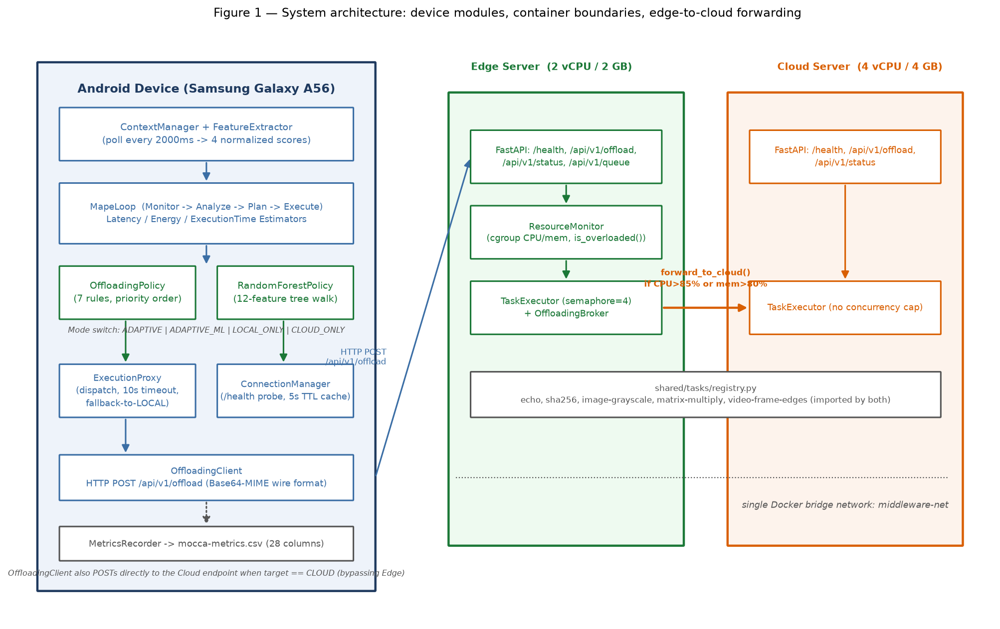
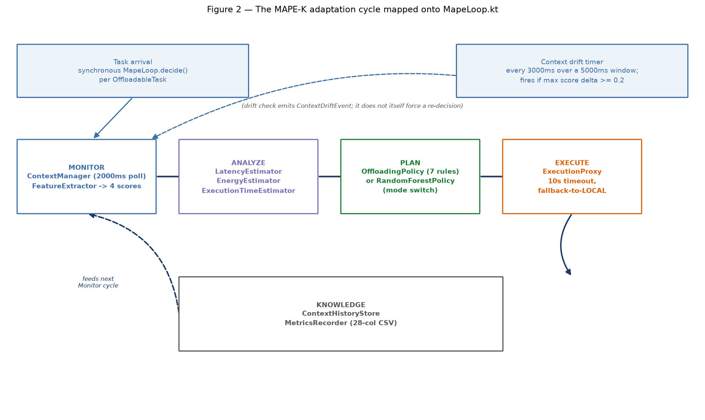
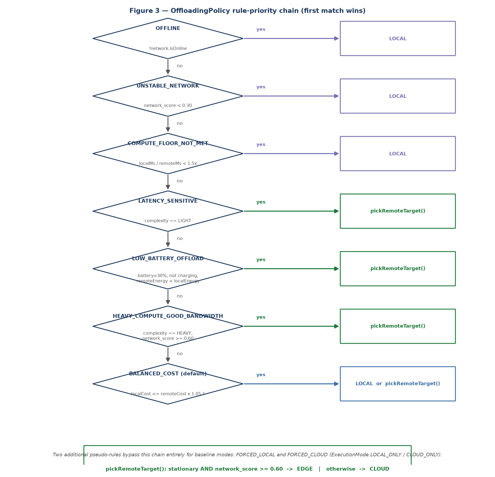

# Implementation

This chapter describes the concrete system that Chapter 5 (Evaluation)
measures: a Kotlin/Android middleware and two containerised Python servers
implementing the MAPE-K autonomic-computing pattern for mobile task
offloading. Every class name, threshold, and constant cited below is read
directly from the shipped source rather than from design intent, so that the
architecture described here is traceable line-for-line to the code that
produced Chapter 5's data.

## 4.1 System Architecture and Deployment Topology

The system spans three physically distinct tiers: an Android device running
the middleware, and two Docker containers — an edge server capped at 2
vCPU/2 GB and a cloud server at 4 vCPU/4 GB — both reachable over HTTP and
joined to a single Docker bridge network (`middleware-net`) so the edge can
resolve and forward to the cloud by container name. `MiddlewareApp` is the
composition root: it constructs and wires the singleton graph — context
manager, MAPE-K loop, both decision policies, connection manager,
offloading client, and metrics recorder — once per process. A foreground
`Service` (`ContextService`) keeps this graph alive independent of any
Activity's lifecycle, since the adaptation loop must keep sampling context
and answering task-submission calls whether or not the demo UI is on
screen.

The two servers are structurally near-identical FastAPI applications
(`/health`, `/api/v1/offload`, `/api/v1/status`), deliberately built from the
**same task registry** rather than parallel implementations, so that "the
same task run on a different tier" is guaranteed by import structure rather
than by keeping two handwritten copies in sync. The one asymmetry is
resource governance: the edge server alone runs a `ResourceMonitor` reading
its own cgroup CPU/memory usage and an `OffloadingBroker` that can forward a
request on to the cloud tier; the cloud server has no such cap, standing in
for a resource pool the thesis treats as effectively unconstrained.



*Figure 1 — Device-side module boundaries against the two server
containers. The device's decision layer (`OffloadingPolicy` /
`RandomForestPolicy`) is switchable independently of the communication layer
underneath it, and the edge's overload path to the cloud is a
same-network container-to-container call the phone never observes directly
— it only ever sees a slower response from the edge endpoint it originally
called.*

## 4.2 The MAPE-K Adaptation Loop

Rather than leaving the MAPE-K pattern as an organisational metaphor, the
five phases are named methods inside one class, `MapeLoop`, whose own doc
comment states the mapping explicitly: **Monitor** reads the latest
`ContextFeatures`; **Analyze** runs three cost estimators; **Plan** invokes
whichever decision policy is currently active; **Execute** hands the result
to `ExecutionProxy` for dispatch; **Knowledge** is not a single class but the
combination of `ContextHistoryStore` (recent context, for the drift check
below) and `MetricsRecorder` (every past decision and its outcome, on disk).

**Monitor.** `ContextManager` polls five collectors — network, CPU, battery,
location, and a smoothed-accelerometer mobility signal — every 2000 ms into
a `ContextSnapshot`. `FeatureExtractor` reduces that snapshot to four
normalized `[0,1]` scores. The one worth stating precisely, because Chapter
5's Figure 1 validates it directly against measured RTT, is `network_score`:
a weighted capability estimate (network type 0.4, signal strength 0.3,
bandwidth 0.3) multiplied by `linkHealth(rttMs)`, which is 1.0 for RTT below
80 ms and decays linearly to 0 at 500 ms.

**Analyze.** `LatencyEstimator`, `EnergyEstimator`, and
`ExecutionTimeEstimator` turn the current features and the task's declared
complexity into predicted local/remote latency and energy figures — the
numbers the policy layer compares.

**Plan.** A decision cycle is triggered two ways, not one: synchronously,
once per `OffloadableTask` submission (`MapeLoop.decide()`), and
independently on a periodic timer that averages scores over a 5000 ms window
every 3000 ms and emits a `ContextDriftEvent` if any score moves by 0.2 or
more. The second path is a notification only — it does not itself force a
re-decision — because re-running Plan on every timer tick regardless of
whether a task is in flight would make "why did the tier change mid-task"
unanswerable from the log.

**Execute.** `ExecutionProxy` dispatches to the chosen tier under a 10 s
timeout; on timeout or exception it falls back to local execution and marks
the row `fell_back = true`, except in the `CLOUD_ONLY` baseline mode, which
rethrows by design so that baseline is never quietly contaminated with local
fallbacks.

**Knowledge.** Every decision's inputs, the chosen rule, and its measured
outcome are appended to `mocca-metrics.csv` (28 columns) — the same file
Chapter 5's every figure is computed from.



*Figure 2 — The five phases mapped onto their implementing classes, with
the two independent triggers shown separately from the cycle itself. The
distinction matters operationally: a task mid-flight is never re-planned
just because the drift timer fired.*

## 4.3 The Offloading Decision Policy: Rules and Learned Model

`OffloadingPolicy.evaluate()` chains seven rules with Kotlin's `?:`
operator — first non-null result wins — in this exact order: **OFFLINE**
(no network → LOCAL), **UNSTABLE_NETWORK** (`network_score < 0.30` →
LOCAL), **COMPUTE_FLOOR_NOT_MET** (end-to-end speedup, local-latency over
remote-latency, `< 1.5×` → LOCAL, since a remote call that only marginally
beats local is not worth its network risk), **LATENCY_SENSITIVE** (LIGHT
task → remote), **LOW_BATTERY_OFFLOAD** (battery `< 30 %`, not charging,
and only if the remote energy estimate actually undercuts the local one →
remote), **HEAVY_COMPUTE_GOOD_BANDWIDTH** (HEAVY task with
`network_score >= 0.60` → remote), and a default, always-resolving
**BALANCED_COST** rule that compares `0.5·latency + 0.5·energy` between
tiers with a 5 % hysteresis margin to stop the decision flapping under
estimator noise near the break-even point. Every remote decision, from
whichever rule triggers it, is resolved to EDGE or CLOUD by one shared
`pickRemoteTarget()`: EDGE if the device is stationary and
`network_score >= 0.60`, CLOUD otherwise — the same threshold value as the
HEAVY_COMPUTE rule's bandwidth check, reused rather than re-declared. Two
further pseudo-rules, `FORCED_LOCAL` and `FORCED_CLOUD`, bypass this chain
entirely and exist only to produce the LOCAL-only/CLOUD-only baselines
Chapter 5 compares against.



*Figure 3 — The rule chain drawn as first-match-wins, not as an unordered
rule set. The priority order is itself a design decision: guardrails
(OFFLINE, COMPUTE_FLOOR_NOT_MET) run before any cost comparison so a
technically-impossible or not-worth-it remote call is never reached in the
first place.*

The same chain, stated formally rather than diagrammatically:

**Algorithm 1** OffloadingPolicy Decision (MAPE-K Plan Phase)

```
Input:  task τ with complexity c ∈ {LIGHT, MEDIUM, HEAVY}
        features φ = (network_score, isStable, batteryPercent, isCharging)
        cost estimates T_local, T_remote, E_local, E_remote
Output: target ∈ {LOCAL, EDGE, CLOUD}, rule

 1: speedup ← T_local / max(T_remote, ε)
 2: if offline or network_score < 0.30 then
 3:     return LOCAL with safety explanation        ▷ OFFLINE / UNSTABLE_NETWORK
 4: end if
 5: if speedup < 1.5 then
 6:     return LOCAL with compute-floor explanation  ▷ COMPUTE_FLOOR_NOT_MET
 7: end if
 8: if c = LIGHT then
 9:     target ← PickRemoteTarget(φ) with latency-sensitive explanation
10: else if batteryPercent < 30 and ¬isCharging and E_remote < E_local then
11:     target ← PickRemoteTarget(φ) with low-battery explanation
12: else if c = HEAVY and network_score ≥ 0.60 then
13:     target ← PickRemoteTarget(φ) with heavy-compute explanation
14: else
15:     costLocal  ← 0.5 · T_local  + 0.5 · E_local
16:     costRemote ← 0.5 · T_remote + 0.5 · E_remote
17:     if costLocal ≤ costRemote × 1.05 then          ▷ 5% hysteresis margin
18:         target ← LOCAL with balanced-cost explanation
19:     else
20:         target ← PickRemoteTarget(φ) with balanced-cost explanation
21:     end if
22: end if
23: return target

Function PickRemoteTarget(φ)
24: if φ.isStable and φ.network_score ≥ 0.60 then
25:     return EDGE
26: else
27:     return CLOUD
28: end if
```

Lines 8–13 preserve the real priority order (LATENCY_SENSITIVE before
LOW_BATTERY_OFFLOAD before HEAVY_COMPUTE_GOOD_BANDWIDTH) as a strict
else-if chain rather than an unordered disjunction, since a LIGHT task at
low battery is decided by its LIGHT-ness (line 8) and never reaches the
battery check on line 10 — first match still wins within this collapsed
branch, exactly as in `OffloadingPolicy.evaluate()`.

`RandomForestPolicy` is the learned alternative to this chain, selected by
an `ExecutionMode` flag (`ADAPTIVE` for rules, `ADAPTIVE_ML` for the forest,
plus the two forced baselines) that `MapeLoop` reads on every call — the
two policies are two backends behind one interface, not two separate
applications. Its 50-tree Random Forest is exported from the training
notebook as a plain JSON array of sklearn's `tree_` structure
(`feature`, `threshold`, `left`, `right`, `value` per node) and evaluated
on-device with a hand-rolled interpreter: each tree is walked as a plain
array traversal to a leaf, and the 50 trees' leaf probability vectors are
summed and normalised — reproducing sklearn's `predict_proba` averaging
without depending on a mobile ML runtime, at under 1 ms per prediction. The
model consumes exactly 12 features (`battery_percent`, `is_charging`,
`network_type_rank`, `network_score`, `rtt_ms`, `bandwidth_mbps`,
`cpu_percent`, `is_stable`, `task_complexity`, `est_local_ms`,
`est_remote_ms`, `speedup`) in a fixed order that is validated against the
notebook's exported `feature_names` at model-load time — a fail-fast check
against silent training/inference skew, since a reordered or renamed
feature would otherwise degrade quietly rather than crash. If the model is
unavailable or throws, `MapeLoop` catches this and falls back to the rule
engine under the rule id `ML_UNAVAILABLE_FELLBACK_TO_RULES`, so an
`ADAPTIVE_ML` device is never left without a decision.

The tree walk and soft-vote, stated formally:

**Algorithm 2** RandomForestPolicy Inference (MAPE-K Plan Phase, ML backend)

```
Input:  task τ, features φ
        forest of N = 50 trees, each with arrays feature[], threshold[],
        left[], right[], value[][] (sklearn tree_, exported verbatim)
        classes = [class label for each column of value[][]]
Output: target ∈ {LOCAL, EDGE, CLOUD}, rule

 1: x ← ExtractFeatures(τ, φ)              ▷ 12-dim vector, fixed FEATURE_ORDER
 2: votes ← zero vector of length |classes|
 3: for each tree t ∈ forest do
 4:     node ← 0                            ▷ root
 5:     steps ← 0
 6:     while feature[node] ≥ 0 do          ▷ feature[node] < 0 marks a leaf
 7:         if x[feature[node]] ≤ threshold[node] then
 8:             node ← left[node]
 9:         else
10:             node ← right[node]
11:        end if
12:        steps ← steps + 1
13:        if steps > |feature| then
14:            abort with "malformed model — cyclic traversal"
15:        end if
16:    end while
17:    votes ← votes + value[node]           ▷ leaf's per-class probability vector
18: end for
19: probs ← votes / sum(votes)               ▷ soft vote, matches predict_proba averaging
20: label ← classes[argmax(probs)]
21: target ← EDGE if label = "EDGE", CLOUD if label = "CLOUD", else LOCAL
22: return target with rule = "ML_PREDICTED_" + target

Function ExtractFeatures(τ, φ)
23: return ⟨ φ.batteryPercent, φ.isCharging, rank(φ.networkType), φ.network_score,
24:          φ.rtt_ms, φ.bandwidth_mbps, φ.cpu_percent, φ.isStable,
25:          rank(τ.complexity), T_local, T_remote, T_local / max(T_remote, ε) ⟩
```

Two details distinguish this from a textbook forest walk. First, line 19
sums and normalises leaf vectors across all 50 trees rather than taking a
hard majority vote per tree — a hard vote would disagree with the
notebook's own reported accuracy, since sklearn's `predict` is itself
built on averaged `predict_proba`. Second, lines 13–15 exist only because
a corrupted or hand-edited model export could otherwise cycle forever on
a UI-thread call; `ExtractFeatures`' column order (line 23) is the one
piece of this algorithm not re-validated on every call — it is checked
once, against the notebook's exported `feature_names`, when the model is
first loaded.

## 4.4 Communication and Server-Side Execution

`ConnectionManager` probes each tier's `/health` endpoint to measure
reachability and RTT, caching the result for 5 s so every decision cycle
does not re-probe the network; a probe that has never run reports a
deliberately-zeroed `STALE` sentinel rather than a signed-integer extreme,
since the latter previously overflowed the freshness check's arithmetic.
`ExecutionProxy` checks this cached reachability before attempting a remote
call at all, so a tier already known to be down fails fast instead of
waiting out OkHttp's connect timeout. `OffloadingClient` then serialises the
task's input bytes as Base64 and POSTs to `/api/v1/offload`; because the
edge server line-wraps its Base64 response at 76 characters per RFC 2045,
the client decodes with `Base64.getMimeDecoder()` rather than the stricter
default decoder, which would otherwise reject the wrapped output outright.

On the server, `OffloadingRequest`/`OffloadingResponse` use Pydantic's
`Base64Bytes` field type rather than a bare `bytes` field specifically
because a bare `bytes` field UTF-8-encodes an incoming JSON string instead
of decoding it — a distinction invisible in tests that only check response
`success`, but fatal to any binary payload. Both servers dispatch to the
same `shared/tasks/registry.py` handlers (`echo`, `sha256`,
`image-grayscale`, `matrix-multiply`, `video-frame-edges`), so "the edge and
the cloud run the same task" is enforced by a shared import, not by
convention. The edge server alone wraps its executor in a
`Semaphore(max_workers=4)` and exposes `/api/v1/queue`; when its own
`ResourceMonitor` reports CPU above 85 % or memory above 80 % of the
container's cgroup limit, `POST /api/v1/offload` is handled by
`OffloadingBroker.forward_to_cloud()` instead of the local executor, which
relays the same request to the cloud server and returns its response
untouched — the forwarding is transparent to the phone, which only
observes a slower-than-expected edge response, never a redirect.

## 4.5 Task Abstraction, Instrumentation, and Summary

Every offloadable unit of work is an `OffloadableTask`: an id, name,
input-size, `TaskComplexity` tag (LIGHT/MEDIUM/HEAVY), input payload, and an
`execute` lambda. That lambda **is** the local implementation; offloading a
task does not run different code remotely, it packages the same
`task_name`, `complexity`, and `inputPayload` into an HTTP request and lets
the server's copy of the same-named handler run instead. This symmetry
holds for four of the five handlers; `video-frame-edges` is a documented
exception — there being no OpenCV available on-device, its local fallback
only extracts the first video frame as a JPEG rather than running the
server's Canny edge detection, a known asymmetry rather than a hidden one.

`MetricsRecorder` is the instrument that makes Chapter 5 possible: every
row of `mocca-metrics.csv` records not only the decision (`rule`, `target`,
`fell_back`) and its outcome (`actual_ms`, `measured_power_mw`,
`measured_energy_mj`) but also every signal the policy saw
(`network_score`, `rtt_ms`, `battery_percent`, `is_stable`, ...) and a
`debug_overrides` column flagging any rows where a condition (e.g. a forced
speedup) was synthetically induced to exercise an otherwise-rare rule —
letting the evaluation notebook exclude those rows from cost-model
validation while still using them for classifier training.

Taken together, this implementation embodies the two claims the thesis
rests its novelty on: the three tiers are physically separate processes
communicating over real HTTP on a real network, not a simulated cost model
with no execution behind it; and the rule engine and the learned model are
two interchangeable backends behind a single `ExecutionMode` switch inside
one running system, rather than two separate research artefacts compared
only on paper.
